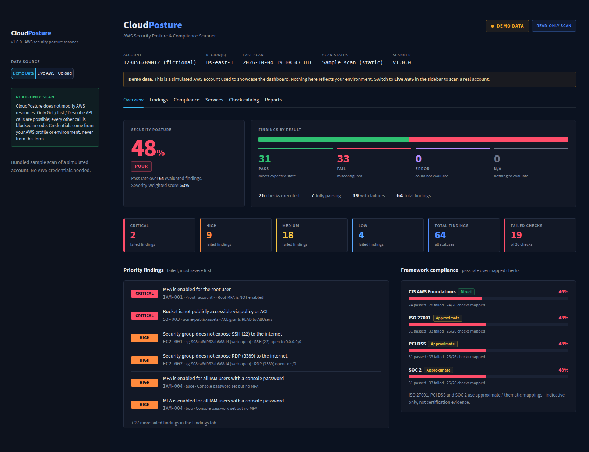
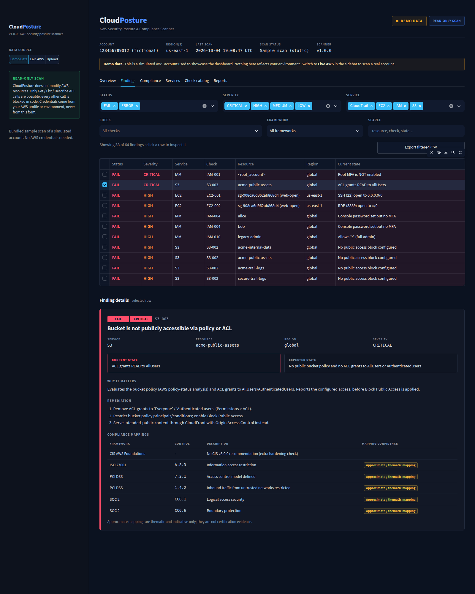
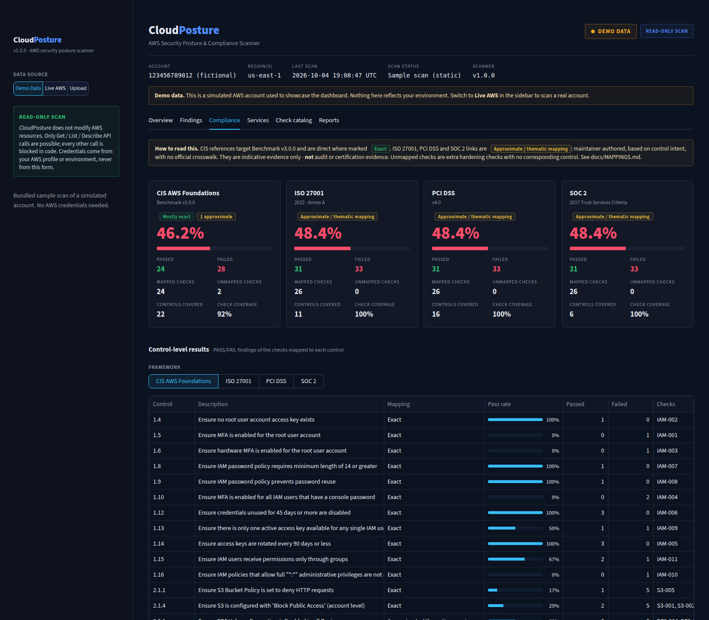

# 🛡️ CloudPosture - AWS Security Posture & Compliance Scanner

A **read-only** scanner that audits an AWS account against **26 CIS AWS Foundations Benchmark-aligned checks**
across IAM, S3, EC2/EBS and CloudTrail, scores the result, maps findings to CIS / ISO 27001 / PCI DSS / SOC 2,
and presents everything in a Streamlit security dashboard with CSV export.



## Highlights

- **Read-only by construction** - every boto3 client carries a guard that raises on any API call that is not
  `Get*` / `List*` / `Describe*` (plus `GenerateCredentialReport`). No remediation code exists. Tested.
- **26 checks**, each with severity, current vs. expected state, remediation steps and framework mappings.
- **Honest scoring** - API failures become `ERROR` and "nothing to check" becomes `N/A`; neither is ever counted as a pass.
- **Honest mappings** - CIS references are marked `exact`; ISO 27001 / PCI DSS / SOC 2 are explicitly `approximate`
  ([methodology](docs/MAPPINGS.md)).
- **Modular & tested** - check registry, per-check isolation, 74 tests running the real boto3 code paths against
  [moto](https://github.com/getmoto/moto) fake accounts. No credentials needed for development.
- **Demo mode** - bundled sample scan (itself produced by running the real scanner on a simulated account).

## Dashboard

A dark security-console UI organised into six tabs. The header always shows **DEMO DATA vs LIVE AWS**, account, region(s),
scan time and scan status, plus a permanent *read-only scan* statement.

| Tab | What it answers |
|-----|-----------------|
| **Overview** | Posture score + rating, PASS / FAIL / ERROR / N/A counts, failed findings by severity, top priority findings, framework pass rates |
| **Findings** | Filter by status, severity, service, check, framework or free text; click a row for resource, current vs expected state, why it matters, remediation and every CIS / ISO 27001 / PCI DSS / SOC 2 mapping with its confidence |
| **Compliance** | Per-framework pass rate, passed/failed, mapped vs unmapped checks, and control-level results. Non-CIS mappings are labelled *Approximate / thematic mapping* |
| **Services** | IAM, S3, EC2, CloudTrail: checks, pass/fail/errors and failed-by-severity distribution |
| **Check catalog** | All 26 checks with latest status and control IDs; searchable |
| **Reports** | Export findings CSV and scan JSON |

| Findings explorer | Compliance |
|---|---|
|  |  |

Data sources (sidebar): **Demo Data**, **Live AWS** (profile, regions, services / specific checks, *Run security scan*) or **Upload** a previously exported scan JSON.
The posture rating is **Poor** (any CRITICAL failure or pass rate < 60%), **Needs attention** (pass rate < 85% or any HIGH failure) or **Healthy**.

## Quick start

```bash
git clone <this repo> && cd CloudPosture-AWS-Security-Posture-Compliance-Scanner-
python -m venv .venv && source .venv/bin/activate        # Windows: .venv\Scripts\activate
pip install -r requirements.txt && pip install -e .

# 1) Demo mode - no AWS account or credentials needed
streamlit run dashboard/app.py                            # choose "Demo data" (default)
python -m cloudposture demo                               # terminal summary of the sample scan

# 2) Real account (read-only) - see "Credentials" below
python -m cloudposture scan --profile cloudposture-readonly
streamlit run dashboard/app.py                            # choose "Live AWS scan" -> Run scan
```

Scan output (CSV + JSON) is written to `reports/` (git-ignored, because it contains account IDs and resource names).
The JSON can be loaded in the dashboard via **Upload scan JSON**.

### CLI reference

```bash
python -m cloudposture list-checks
python -m cloudposture scan --profile P [--regions us-east-1,eu-west-1] [--services IAM,S3] [--checks IAM-001,S3-002] [--output-dir reports]
python -m cloudposture scan --role-arn arn:aws:iam::123456789012:role/CloudPostureReadOnly   # optional AssumeRole
python -m cloudposture demo [--output-dir reports]
```

## Credentials (safe setup)

CloudPosture never accepts or stores access keys - it uses boto3's standard credential chain only.

1. **Best:** IAM Identity Center (SSO): `aws configure sso --profile cloudposture-readonly`, then `aws sso login --profile cloudposture-readonly`.
2. Or a dedicated IAM role / user with the read-only policy below; reference it with `--profile`, `CLOUDPOSTURE_PROFILE`, or `CLOUDPOSTURE_ROLE_ARN`.
3. Optional settings go in `.env` (copy `.env.example`; `.env` is git-ignored). **Do not put keys in it.**

### Required IAM permissions

Attach **[`docs/iam-policy.json`](docs/iam-policy.json)** (least privilege: only the 25 `Get*/List*/Describe*` actions the scanner calls, plus
`iam:GenerateCredentialReport`). A test asserts that the policy covers every API call made by a full scan.
Alternatively the AWS-managed **`SecurityAudit`** policy is a superset of these permissions (confirm for your account).

`iam:GenerateCredentialReport` is the only non-`Get/List/Describe` call: it (re)builds the IAM credential-report
snapshot needed for MFA/key-age checks and changes no resource.
If a permission is missing, affected checks show status `ERROR` with the denied action - they are never silently passed.

## Implemented checks

| Service | Checks |
|---------|--------|
| IAM (11) | root MFA · root access keys · root hardware MFA · users without MFA · key rotation ≤90d · credentials unused ≥45d · password length ≥14 · password reuse ≥24 · >1 active key · `*:*` admin policies · direct user policies |
| S3 (5) | account Block Public Access · bucket Block Public Access · public via ACL/policy · default encryption · deny-HTTP (TLS only) |
| EC2 (6) | SSH 22 open to world · RDP 3389 open to world · default SG restricts traffic · EBS default encryption · unencrypted volumes · IMDSv2 required |
| CloudTrail (4) | multi-region trail logging mgmt events · log file validation · CloudWatch Logs integration · KMS encryption |

Full table with CIS/ISO/PCI/SOC 2 references and remediation text: **[docs/CHECKS.md](docs/CHECKS.md)** (generated from the code).

## Scoring

Only `PASS` and `FAIL` findings are scored.

| Metric | Definition |
|--------|-----------|
| Pass rate (headline) | `passed ÷ (passed + failed)` over resource-level findings (one finding per bucket, SG, user, trail…) |
| Check pass rate | share of checks where *every* evaluated resource passed |
| Weighted score | same, weighted CRITICAL 10 · HIGH 6 · MEDIUM 3 · LOW 1 |
| Severity / service | pass & fail counts per bucket |
| Framework pass rate | pass rate over findings whose check maps to that framework, shown with mapped-check coverage |

## Architecture

```
src/cloudposture/
  aws/session.py        client factory (profile/role/region, retries) + read-only guard
  config.py             env/.env -> ScanConfig (thresholds, regions, profile)
  models.py             Finding, Mapping, Status, Severity, ScanResult (JSON round-trip)
  checks/               base.py (registry, FindingFactory, context) + iam.py s3.py ec2.py cloudtrail.py
  compliance/mappings.py  single source of truth for CIS/ISO/PCI/SOC2 references
  scanner.py            runs checks in isolation; failures -> ERROR findings
  scoring.py            summaries: pass rate, severity, service, frameworks
  reporting.py          CSV (formula-injection safe) / JSON export
  cli.py                scan | list-checks | demo
dashboard/              Streamlit UI: app.py (shell), sidebar.py, components.py (escaped HTML builders),
                        charts.py, data.py, theme.py, views/ (one module per tab). No scoring logic lives here.
tests/                  moto-based integration tests + pure-logic tests
scripts/                generate_sample_data.py, generate_docs.py
sample_data/            bundled demo scan (JSON + CSV)
docs/                   CHECKS.md, MAPPINGS.md, iam-policy.json
```

Adding a check = one decorated function in `checks/` + one entry in `compliance/mappings.py`
(registration fails fast if the mapping is missing), then `python scripts/generate_docs.py`.

## Development

See [docs/DEVELOPMENT.md](docs/DEVELOPMENT.md) for local setup, connecting AWS, and a starter prompt for Claude Code (project rules: [CLAUDE.md](CLAUDE.md)).

```bash
pip install -r requirements-dev.txt && pip install -e .
python -m pytest -q                         # all tests, offline
python scripts/generate_sample_data.py      # regenerate demo data
python scripts/generate_docs.py             # regenerate docs/CHECKS.md
```

## Limitations

- **Point-in-time, configuration-only.** No runtime/traffic analysis, no vulnerability scanning, not a certification.
- **Single account** per run (use `--role-arn`/profiles per account). Organization-wide aggregation is not implemented.
- **IAM-003 (root hardware MFA):** the API shows virtual MFA devices but cannot tell a hardware token from a passkey; PASS means "MFA present, not virtual".
- **IAM-010** evaluates customer-managed attached policies only (not AWS-managed `AdministratorAccess`, inline policies or permission boundaries); no effective-permission analysis.
- **S3-003** reports configured policy/ACL exposure *before* Block Public Access is considered.
- **CT-001** accepts classic and advanced event selectors that record all management events; org-trail edge cases from a member account may not be fully visible.
- Not implemented: RDS, VPC flow logs/NACLs, CloudWatch metric-filter alarms (CIS section 4), AWS Config, KMS rotation, S3 MFA-delete, and CIS items that require manual evidence.
- **ISO 27001 / PCI DSS / SOC 2 mappings are approximate** (see [docs/MAPPINGS.md](docs/MAPPINGS.md)). Verify CIS numbering against the licensed benchmark for audits.

## What is real vs. simulated

| Real | Simulated |
|------|-----------|
| All scanning logic and boto3 calls, scoring, CSV/JSON export, dashboard, read-only guard | The **demo data** and the test fixtures come from [moto](https://github.com/getmoto/moto), a fake AWS. The demo account ID `123456789012` and its resources are fictional. |

The scanner has been exercised end-to-end against moto only; moto does not replicate every AWS behaviour,
so run it against a non-production account first and review results.

## License

MIT
